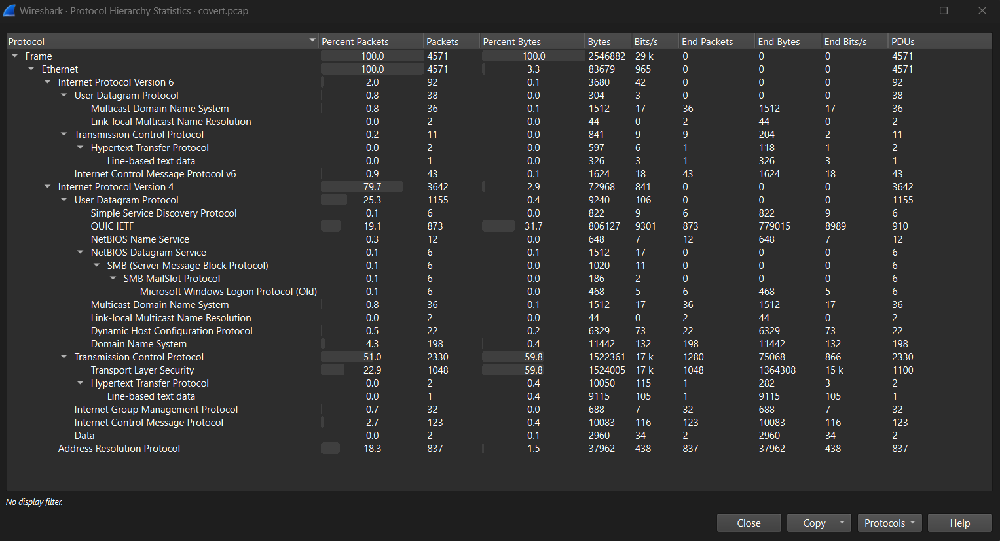
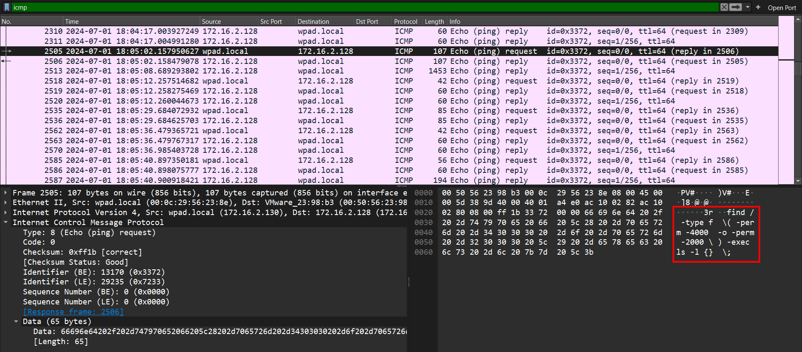
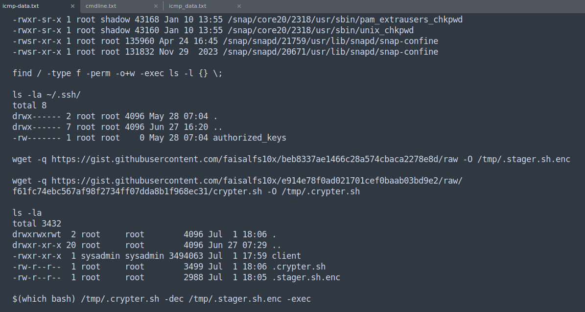
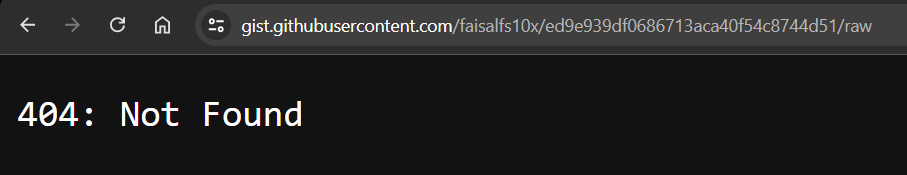
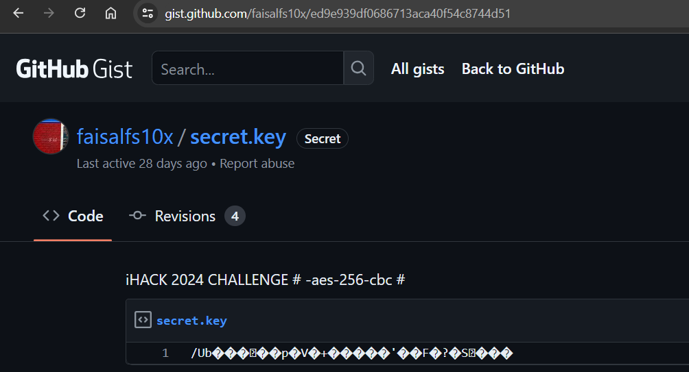
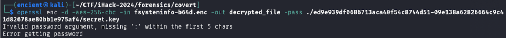
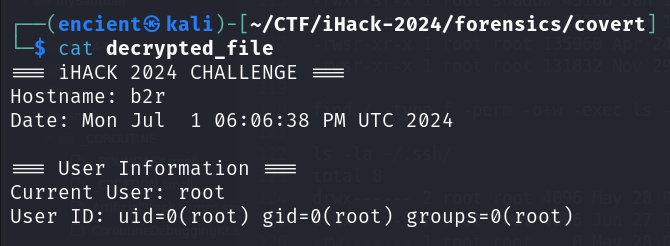
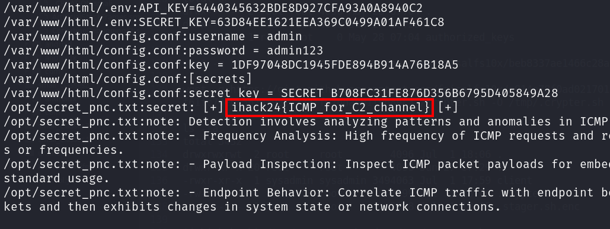

## Description
Our team suspected that the server has been compromised based on the network packets. We observed unusual network traffic indicating potential data infiltration and exfiltration. Could you confirm whether any information has been exfiltrated?

Attachment: `covert.pcap`

## Solution

///caption
///
Looking through the protocol hierarchy, nothing really catches our eye from the first glance. We proceed to analyze some common protocols such as TCP and HTTP but found nothing interesting.


///caption
///
We then notice that there are some interesting output in the data section of ICMP traffic. Since the description mentions data exfiltration, we think that this might be performed through ICMP data.

```bash {frame="none"}
tshark -r covert.pcap -Y "icmp" -T fields -e data.data | uniq > icmp-data.txt
```
Therefore, we use tshark to output all the encoded icmp data and output to a text file, and try to convert it from hexadecimal to ASCII.


///caption
///
From the decoded output, we are able to get some information:

```
- stager.sh.enc - stager script [https://gist.githubusercontent.com/faisalfs10x/beb8337ae1466c28a574cbaca2278e8d/raw]
- crypter.sh (404 not found) [https://gist.githubusercontent.com/faisalfs10x/e914e78f0ad021701cef0baab03bd9e2/raw/f61fc74ebc567af98f2734ff07dda8b1f968ec31/crypter.sh]
- key for encryption and decryption process (404 not found) [https://gist.githubusercontent.com/faisalfs10x/ed9e939df0686713aca40f54c8744d51/raw]
- fsysteminfo.txt - data that is being exfiltrated
- fsysteminfo.txt.enc - data that is being exfiltrated but encrypted [https://gist.github.com/faisalfs10x/a6d5180d28ddb4db8a708f442d589a3c]
```

We also know that some of the files are being deleted from the system and it is no longer accessible. Therefore, using all the information given, we know that we need to decrypt the exfiltrated data (fsysteminfo.txt.enc) using the key in order to get the flag.


///caption
///
When we browsed through the link `crypter.sh`, we tried to go one directory before to see if there is any possibility to get the file but failed. Therefore, we “assumed”/“remembered wrongly” that we did the same to the link of the key. So, we stuck there for the entire day ;D


///caption
///
After confirming with the challenge creator, we reattempt the challenge as we are quite sure that we are on the right path. Trying the same method again on the link to the key (which is to visit the main path - remove `/raw` from the URL), we finally get the key that we need.


///caption
///
We then proceed to decrypt the file. But it failed! The clock is ticking!!!!!! We panic!!!!!! WHY!!!!!!!!!!

After asking our best friend ChatGPT which gave us the correct command (note that the encrypted file has to be base64 decoded first before decrypting it with the key):

```bash {frame="none"}
openssl enc -d -aes-256-cbc -in fsysteminfo-b64d.enc -out decrypted_file -pass file:secret.key
```


///caption
///
Felt super relieved when we saw the word "iHACK 2024" (cuz we are on the right path...)


///caption
///
Just scroll and look through the file to find the flag or you could also use `grep` command to search for the flag format. 

## Flag
`ihack24{ICMP_for_C2_channel}`