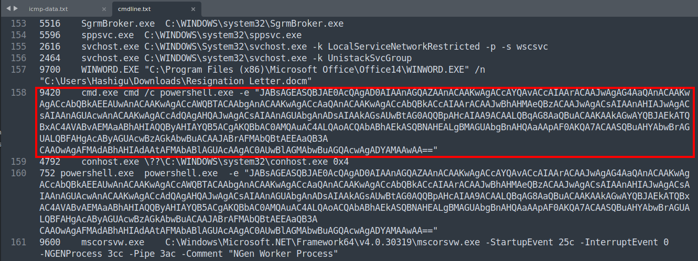
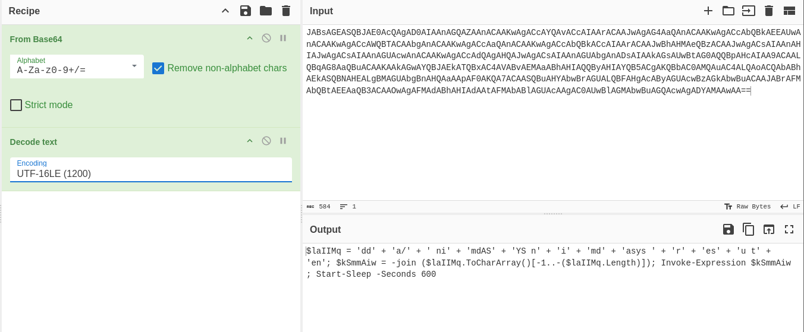
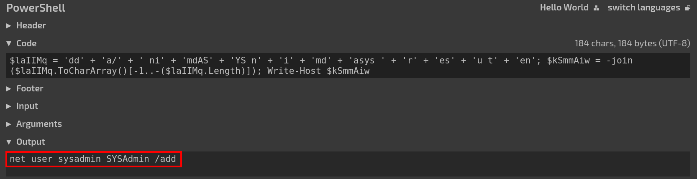

## Description
The Digital Forensics and Incident Response (DFIR) team confirmed that the CEO's PC has been compromised due to abnormal behaviour detected on the workstation. They also noted suspicious user creation activity related to this incident. <br>
As an analyst, you have been provided with the memory dump file from the CEO's workstation to perform a memory forensic analysis. 

Attachment: `Windows.vmem`

## Solution
```bash {frame="none"}
vol3 -f Windows.vmem windows.cmdline.CmdLine > cmdline.txt
```
The given file has the name “Windows.vmem”, which gives us a hint that this is a Windows memory dump. Knowing that user creation activity by the attacker is mostly done using the command line, we immediately run Volatility 3 with the plugin for dumping the command line. Note that we also redirects the output to a text file named `cmdline.txt` so that we can refer later. 

 
Looking through the result, we saw an encoded command ran with powershell which might be malicious. 

 
After decoding it in PowerShell, we can see that it is a little obfuscated, hence we are still unable to understand what is going on there. But the obfuscated code kind of gave us another assurance that this is the malicious code we are looking for. 

 
To save time, just run the code in [tio.run](https://tio.run/#). Replace Invoke-Expression to Write-Host to print the obfuscated code instead of executing it. From the output we can see the command `net user sysadmin SYSAdmin /add` which is trying to add a user named `sysadmin` with the password of `SYSAdmin`. 

## Flag
`ihack24{sysadmin_SYSAdmin}`