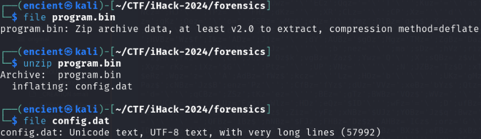
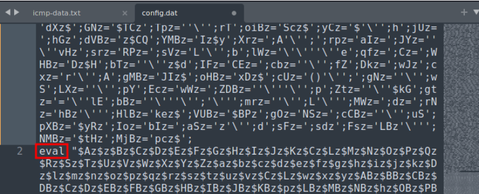
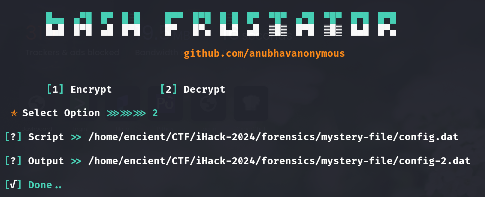
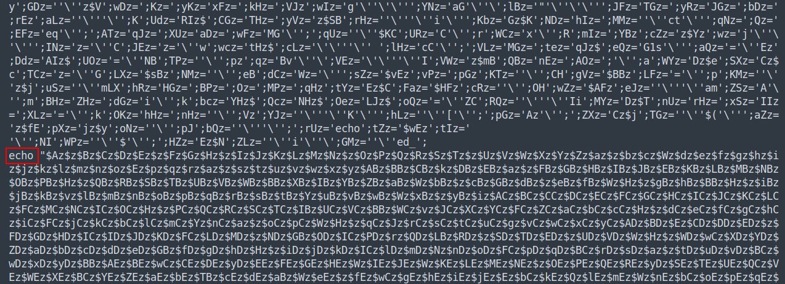
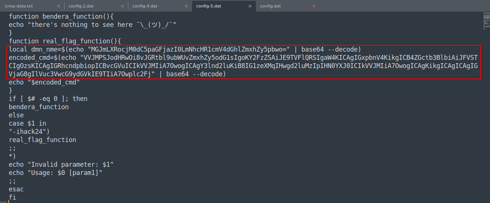
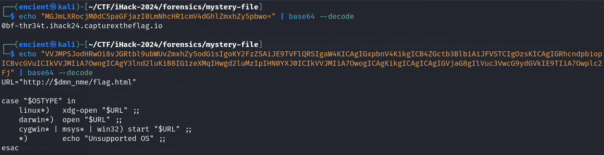

## Description
A company has engaged your team to conduct a Digital Forensics and Incident Response (DFIR) analysis on their compromised image servers. During the investigation, your team discovered a suspicious file named "program.bin" in an unconventional binary. The nature of this file, including its content and unusual placement, strongly suggests that it could be a malicious payload or a backdoor script. The team is tasked with analyzing this file to determine its purpose and potential threat. 

Attachment: `mystery file.zip`

## Solution
 
///caption
///
By using `file` command to see the file type, we know that it is a zip file. After unzipping it, it gives us `config.dat` which seems like a file with plaintext. 

///caption
///
Looking into the file, it seems like it is heavily obfuscated. However, instead of the .dat file, it looks more like a bash script as it contains `eval`.

!!! tip
    `eval` in Bash programming language is mostly used to execute command.  

Therefore, we proceed to search for tools that can perform bash script deobfuscation. Here are the tools that can be used:  
- [tio.run](https://tio.run/#)  
- [DeBash](https://dsh.deno.dev/)  
- [Bash Frustrator](https://github.com/anubhavanonymous/Bash_Frustator)

 
///caption
///
We used Bash Frustrator which is a Python tool to deobfuscate the script.

 
///caption
///
After the first deobfuscation process, the script seems like no change and still has long unreadable strings. However, we noticed that `eval` became `echo`, and the script is actually shorter compared to the previous script. Therefore, we think that the script might have several layer of obfuscation. 

///caption
///
After several times of deobfuscation, we can finally read and understand the script. There is a function which has encoded command. 

///caption
///
Decode the command and we will get the content. We need to visit the URL to get the flag.  

 
///caption
///

## Flag
`ihack24{0bfusc4t3d_thr34t3}`