A basic B2R machine for beginners.

## Task 1
### Description
We found an IP address associated with Flaming Donkey. Scan the IP to see what service they are implementing. What are the open ports? <br>   

### Solution
```bash {frame="none"}
nmap -p- -A -T4 10.75.102.188 
```

`-A` is the combination of `-O`, `-sC` and `-sV`. By running this simple command, we can scan all the open ports on this IP address. <br>   
Answer: `21,22,5000`


## Task 2
### Description
Check out the ports found in your nmap scan. Which services take a username and password? Which port contains a website you can enumerate? Inspect the website, what can you find? What is the username's password? <br>   

### Solution
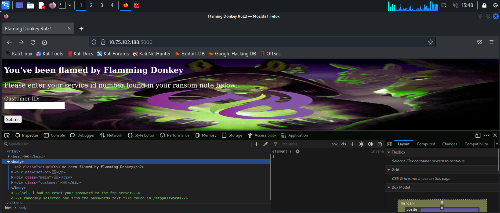 <br>   
Port `5000` is running a website. By viewing the source code we will be able to see the comment stating that the password of the user `carl` is in `/ftppasswords`. <br>   

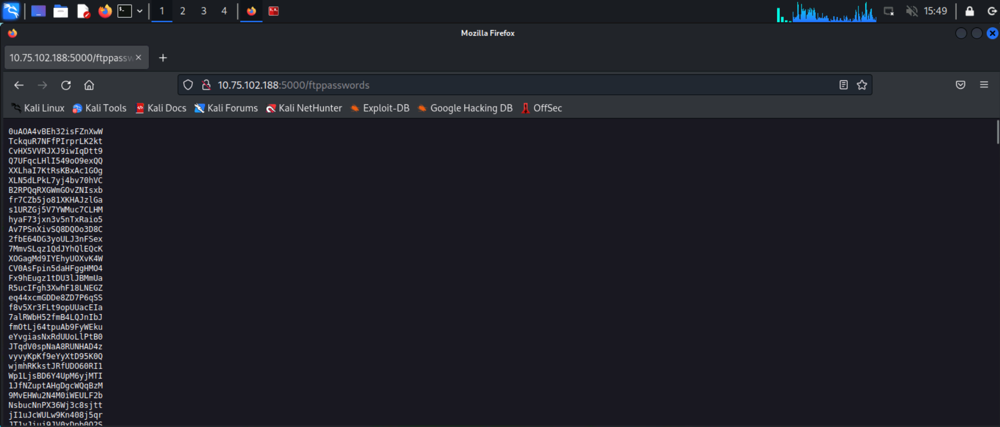 <br>   
Browsing to `/ftppasswords` shows a list of passwords. We can download the list for later using the command below:
```bash {frame="none"}
wget http://10.75.102.188/ftppasswords
```

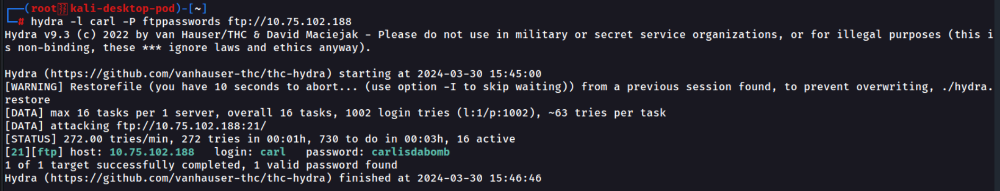 <br>   
We can then use `hydra` and provide username `carl` using `-l` and brute force the password using `-P` by providing the password list. <br>   
```bash {frame="none"}
hydra -l carl -P ftppasswords ftp://10.75.102.188
```
This command will connect to FTP service as user `carl` and brute force the passwords in `ftppasswords` to find the correct password. <br>   
Answer: `carlisdabomb`

## Task 3
### Description
Now that we have a username and password, log into the ftp server. Look around, be nosy, read the messages. What is the name of the directory where the login page is found?

### Solution
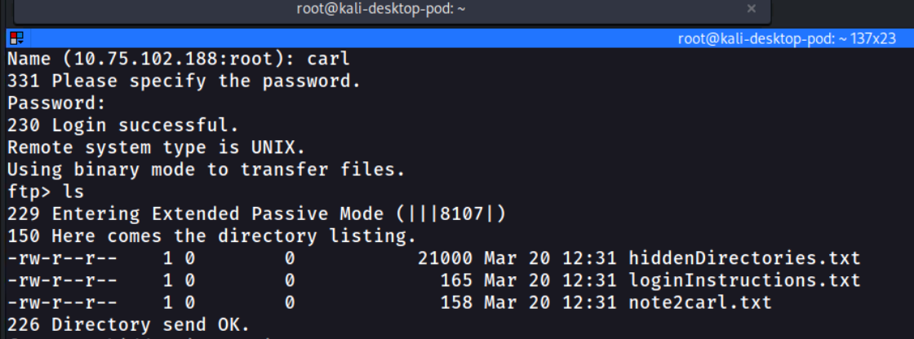 <br>   
Use `ls` to list the files and directories in the FTP server and we can see that there are 3 text files in it. We can then use `get <file>` to download each of the file to our attacker machine.

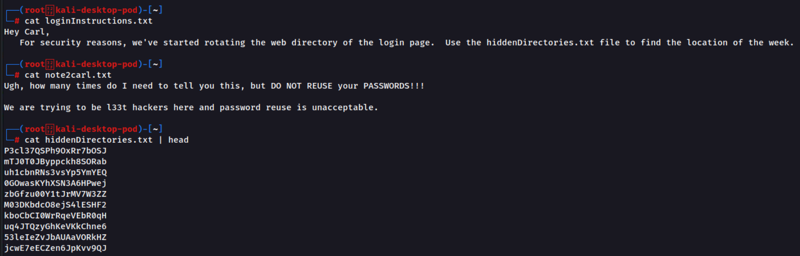 <br>   
From those files, we know that user `carl` reuses his password somewhere. Other than that, we also get a list of hidden directories which one of them might be the login page. Therefore, we need to brute force the directory in order to get the correct directory name. <br>   
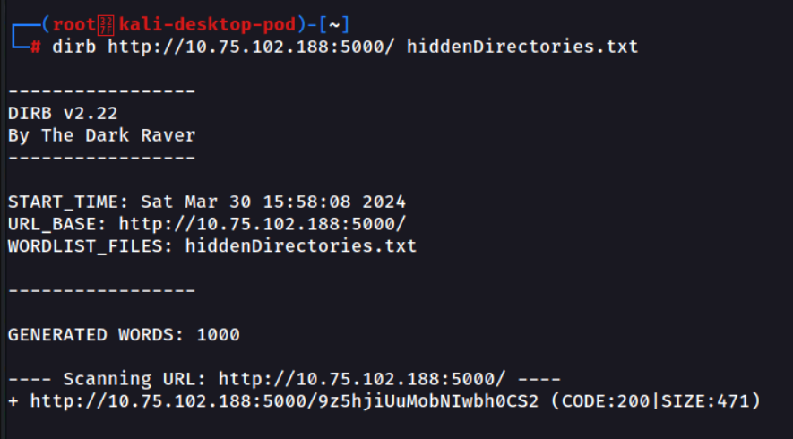 <br>   
We can use `dirb` by providing the wordlist `hiddenDirectories.txt` to brute force the directory. Scanning result with status code 200 shows the correct directory of the website has been found. <br>   
Answer: `9z5hjiUuMobNIwbh0CS2`

## Task 4
### Description
What is the password for Randy?

### Solution
From Task 3, once we get the correct directory name, we can then login as carl, which will redirect us to the page below. <br>   
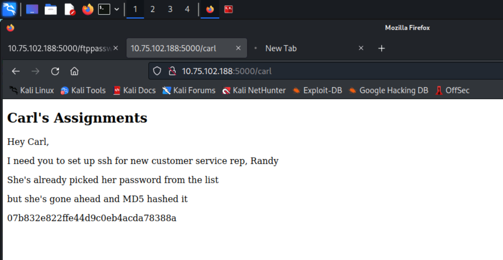 <br>   
From this page we know that user `randy` has a password which is also taken from the password list. However the password is hashed into MD5 format. Therefore, we can create a script to convert the password list `ftppasswords` into MD5 hash, and compare with Randy's password to find the correct password. <br>   
```python {frame="none"}
import hashlib

# Your provided MD5 hash
target_hash = "07b832e822ffe44d9c0eb4acda78388a"

def hash_passwords(file_path):
    with open(file_path, 'r') as file:
        for line in file:
            # Remove newline and whitespace
            password = line.strip()
            # Convert the password to an MD5 hash
            hashed_password = hashlib.md5(password.encode()).hexdigest()
            # Compare the hash to the target hash
            if hashed_password == target_hash:
                print(password)
                return  # Exit after finding the first match

hash_passwords('ftppasswords')
```
With the help of ChatGPT, I've created a simple python script to do this. By running the python script, we can get the correct password in plaintext. <br>   
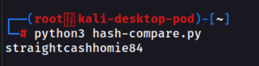 <br>   
Answer: `straightcashhomie84`


## Task 5
### Description
What is the number found in `decrypt.txt`?

### Solution
Once we get the password for user `randy`, we can use the credentials to connect to SSH using the command below and provide the password after the prompt:
```bash {frame="none"}
ssh randy@10.75.102.188
```

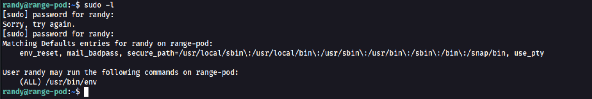 <br>   
Then we can do basic privilege escalation by running the command `sudo -l` to see the sudo privileges of Randy.

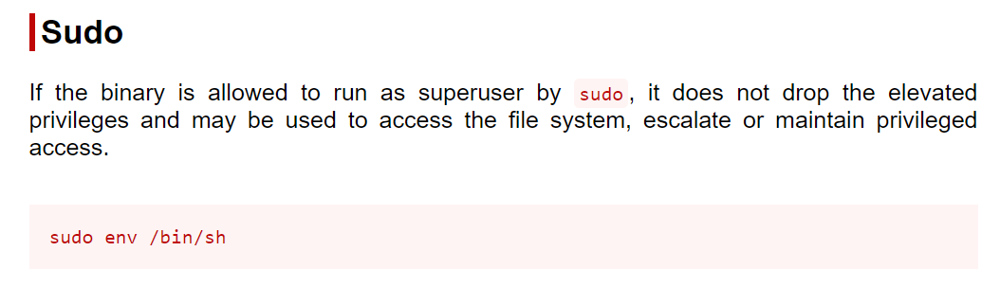 <br>   
Therefore, we can visit [GTFOBins](https://gtfobins.github.io/)to get the command to be used to generate a root shell. <br>   
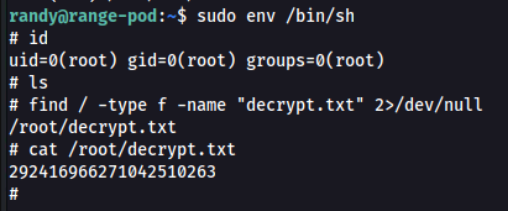 <br>   
Lastly, we can use `find` command to search recursively from root `/` directory to find a file named `decrypt.txt`. <br>   

> 💡 `2>/dev/null` is used to disregard any error messages so that those error messages will not flood our screen which might make it harder to find the successful result.
<br>   

Answer: `292416966271042510263`