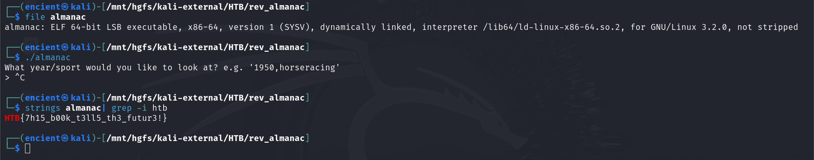

*Simple RE challenge*

## Description
You've managed to steal Biff's secret sports channel almanac! Could he have hidden a flag somewhere inside? <br>   
Attachment: `almanac`

## Solution
 <br>   
By using `file` command to see the file type, we know that it is an 64 bit ELF file. <br>   

```bash {frame="none"}
strings almanac | grep -i htb
```
As my first step of solving simple reverse engineering challenges, I will use `strings` command to see if we can get any information or even flag. For this challenge, we can easily get the flag using this command. 

## Flag
`HTB{7h15_b00k_t3ll5_th3_futur3!}`