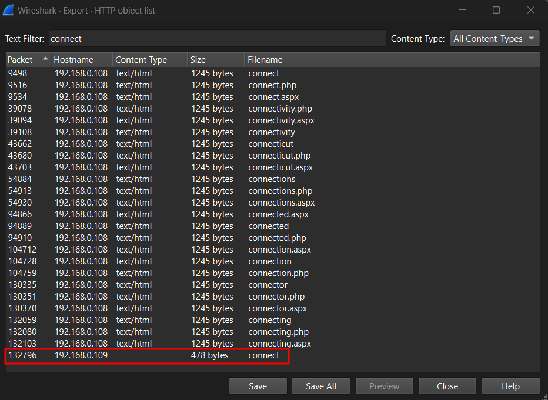

*PowerShell script deobfuscation*

## Description
A public-facing web server was compromised and files were lost. Can you help us to understand the situation?

Attachment: `capture.pcapng`

## Solution

From `Protocol Hierarchy` that we can get from the `Statistics` tab in Wireshark, the protocols involved in this packet is HTTP only. We can try to filter for `Line-based text data` to see if there is any useful information.

From the filtered output, we will see that most of the result shows 404 Not Found. By scrolling to the bottom, we can see that there are some 200 OK output showing the successful request and response to the client. Therefore, we can view the stream of the result by right clicking, and choose `Follow` --> `TCP Stream`.

We can see that the attacker uploaded a PHP webshell named `webshell.php`. From here we know that:  
- IP address of attacker: `192.168.0.108`
- IP address of victim: `192.168.0.109`

It can be seen that the attacker has gained initial access through the uploaded webshell. The attacker ran `whoami` as first command to see the current role.

By scrolling to the bottom of this stream, we can see that the attacker ran a command to download a file from `http://192.168.0.109:80/connect` to the server (victim).

To search for this request, we can go to `File` --> `Export` --> `HTTP` to see the packet and follow TCP stream to see the packets in a stream.

We can see that it is a PowerShell script that is trying to remotely connecting to the victim machine and send commands.

Analyzing the stream further, we can see that the attacker is trying to download and execute a file named `update.txt`. After the execution, there is a file named `test` which consist of a suspicious string.

Using the same method, we can see the contents of the file without downloading it. The payload is obfuscated, so we need to deobfuscate it to know its exact content.

After deobfuscating it, we can see that it is trying to encrypt a file named `Credentials.xlsx`.

!!! note "Process of encrypting the file"
    1. XOR `Credentials.xlsx` with a key (value of `whoami` command)
    2. Base64 encode the encrypted file
    3. Output the file and name it as `test`
    4. Remove the original `Credentials.xlsx`

///caption
///
Therefore, we can create a python script to decrypt the file and output to the correct format which is `.xlsx`. Opening the file will give us the flag.

## Flag
`HTB{c@ugh7_th3_bAd_guY!}`