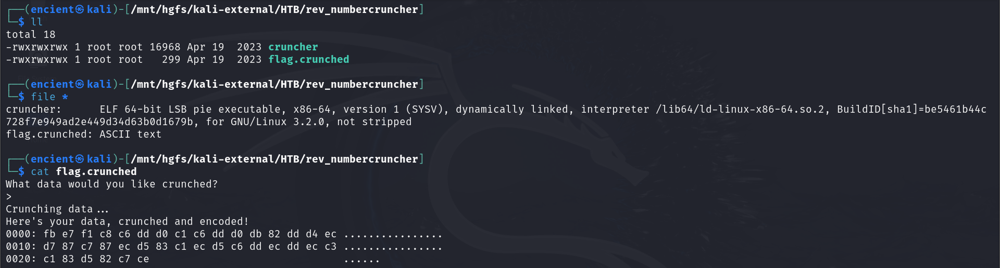
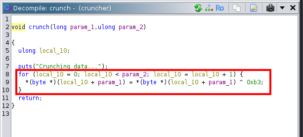
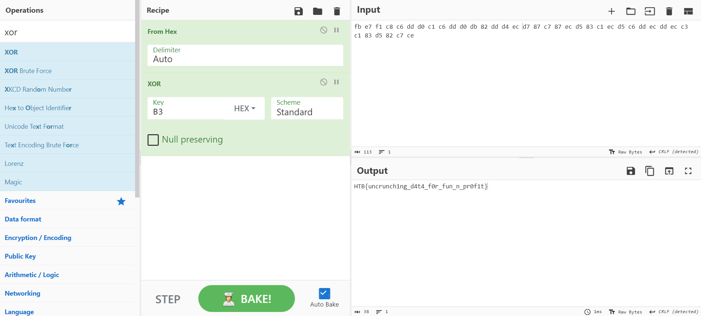

*Simple XOR RE challenge*

## Description
Our brand new number-crunching program makes data impossible to retrieve! To prove it, try and decode this crunched up flag!

Attachment: `cruncher`, `flag.crunched`

## Solution
From the description, we know that the flag has been encrypted and has been outputted to `flag.crunched`.

///caption
///
By looking at the encoded flag, we can see that it is in hex format.

///caption
///
By using [Ghidra](https://ghidra-sre.org/), we can take a closer look into one of the functions named `crunch` which seems to be the function that encrypts the flag. From the function, we can see that the input is being xored `^` by the hex key `b3`.

///caption
///
Therefore, we can go to [CyberChef](https://gchq.github.io/CyberChef/) to decode and decrypt it to get the flag.

## Flag
`HTB{uncrunch1ng_d4t4_f0r_fun_n_pr0f1t}`